### This repository is an **idea sketch** for a next-generation plasma control system. Think of it as a **macro-level Proof of Concept (PoC) and brainstorming repository** for the integrated verification of HPC technology and hardware-software convergence architecture. It is designed to be an extremely lightweight repository—to the point where it could easily be read as a sci-fi novel.

# Discrete Filament Router

### The DFR system is an concept that attempts to bypass the 3D massive plasma control constraints of conventional fusion methods (such as the Tokamak approach) by enforcing a macro-1D constraint, applying directional bias, and deploying a 4-layer hardware-software converged control loop.

---

## Before diving into the technical details, here is a brief overview of my personal infrastructural design philosophy regarding nuclear fusion.

## Conventional nuclear fusion methodologies carry a critical **volumetric control constraint (Volumetric Constraint)** inherent in managing a massive three-dimensional plasma profile.

**To overcome this limitation,** this infrastructure downscales the plasma into discrete, 1mm micro-packets and isolates them within a compact, 30cm-radius closed-loop vacuum pipe corridor. A liquid lithium-lead (Li-Pb) alloy shell layer is deployed along the outer boundary. By utilizing N-configured 50Hz control magnets to apply a sequential Z-axis directional bias, the system maintains the dynamic equilibrium of this liquefied lithium jacket while structurally reducing the once-complex plasma flow into a simplified, **macro-1D linear stream**.

**However, dispersing the plasma into such fragmented, one-dimensional states** lowers its overall density, which could severely hinder sustained nuclear fusion.

**To resolve this density drop,** the architecture pairs high-frequency, continuous D-T (Deuterium-Tritium) packet injection with controlled micro-scale lithium vaporization. This process triggers a **temporal density cascade (Temporal Density Cascade)** effect, where trailing packets actively leverage the residual kinetic energy and byproduct density fields left behind by the decay of preceding packets. This sequential re-ignition chain ensures that the Lawson Criterion is comprehensively satisfied even within a decentralized environment.

**Yet, during this continuous chain ignition,** vaporized lithium introduces a critical risk of poisoning the core plasma packets and disrupting overall system stability.

**To counter this contamination issue,** the system weaponizes the extreme **surface-area-to-volume ratio** inherent to micro-scale plasma packets. The high-energy surface layer rapidly expels impurities outward while naturally forming a **self-shielding ionized blanket** around the core, fundamentally neutralizing lithium contamination and guaranteeing stable transport throughout the corridor.

**Even during stable transport along the pipeline,** the plasma’s intrinsic macro-turbulences and instabilities will inevitably attempt to manifest.

**To suppress this turbulence,** rather than relying on conventional methods that use continuous magnetic fields for forced suppression, the system strategically distributes **magnetic null-zones (Zero-Field Gaps)** where the magnetic fields completely cancel each other out. By introducing a structural **pulsation effect (Pulsation)** into the linear flow, macro-instabilities are induced to autonomously disrupt, dilute, and dissipate.

**Because the entire network functions under this precisely controlled, pulsating stream,** the underlying control logic and emergency fail-safe sequences can be streamlined to the bare minimum, enforcing absolute deterministic system integrity.

**This simplified control architecture** eliminates the need for catastrophic plant shutdowns, rendering **periodic structural flushing (Periodic Structural Flushing)** completely viable during live operations and maximizing the overall structural resilience of the facility.

**Ultimately, once the entire closed-loop network** transitions into a complete steady-state dynamic equilibrium, the architecture aims to **eliminate the initial high-energy ignition sequence entirely**. Bypassing the massive external power injections traditionally required for subsequent operational cycles, the system shifts into a highly efficient, self-sustaining cruise state that continuously cycles its own energy.

**The physics notes containing my structured thoughts on this infrastructure design can be found here:** [`docs/Physics_note.md`](docs/Physics_note.md)

---

## Designed in alignment with the infrastructure above, here are the 4 control layers tasked with real-time self-stabilization and integrated orchestration.

The system's real-time self-stabilization and integrated control are executed via a top-down and bottom-up closed-loop chain spanning four distinct tiers, from the lowest silicon edge up to the highest inference tower.

### 🧠 Layer 4 (Cognitive Inference): The Macro-Inference Brain
*   **Architectural Summary:** A top-down intelligent command deck that passively monitors the plant-wide thermodynamic state and external grid demands to orchestrate total power output.
*   **Control Execution (Output):** Upon detecting structural piping overheating or a vacuum suction conductance bottleneck, it immediately forces the fuel injection frequency down to its floor threshold (`HZ_MIN`), real-time executing a **'Homeostasis Lock'**.

### 👑 Layer 3 (Global Orchestration): The Self-Healing Heart
*   **Architectural Summary:** An asynchronous software backbone that ingests fault tokens offloaded by the underlying embedded layers to autonomously restore the structural integrity of the global pipeline network.
*   **Control Execution (Output):** Upon detecting a faulty node, it instantly applies a virtual grid mask isolation path and atomically flushes the low-level chipset register spaces to restore them back to the baseline.

### 🏰 Layer 2 (Hardware-Software Bridge): The Zero-Copy Conduit
*   **Architectural Summary:** A pure embedded data pipeline that interconnects the lowest silicon register physical address space with the upper orchestration kernels at near-zero latency.
*   **Control Execution (Output):** Achieves a zero-copy 0ns injection pipeline and entirely eliminates division operations during valve occlusion controls, driving actual vacuum dissipation speeds under 10ns via completely branchless injection.

### ⛓ Layer 1 (Hardware Silicon Edge): The Real-Time Gate
*   **Architectural Summary:** The lowest-level physical silicon edge layer deployed at the absolute front of the accelerator pipeline, directly commanding discrete plasma packets and power semiconductor inverter coil arrays.
*   **Control Execution (Output):** Enforces numerical stability, and upon detecting a continuous accumulation of cascading faults, triggers a branchless MUX to trap and isolate vacuum explosion anomalies inside the internal buffer corridor zones.

---
👉 **The branchless mathematical matrices, C++ bare-metal driver binding addresses, and detailed specifications for the 6-layer sandwich architecture can be reviewed alongside actual architecture filenames in the [Technical System Specification (docs/System_Specs.md)](docs/System_Specs.md).**

```mermaid
graph TD
    %% Global Control Loop Structural Definition
    subgraph SYSTEM_LAYERS [" DFR 4-Layer Top-Down/Bottom-Up Closed-Loop & Real-Time Self-Stabilization Specification"]
        direction TB

        %% Layer 4 Definition
        L4["<b>🧠Layer 4 : Macro-Cognitive Inference </b><br><font size=2>• 2.0s background passive scan, external Grid demand synchronization, and global valve opening rate average tracking.<br>• Core Control: Instantly forces the fuel dial down by 5kHz upon capturing piping overheating (&gt;520°C) or a variable valve average opening rate bottleneck (ξ_avg &lt; 0.8).<br>• Fully isolates complex vacuum-thermodynamic inference from the real-time hot path driver to fundamentally prevent runtime jitter injection.</font>"]

        %% Layer 3 Definition
        L3["<b>👑Layer 3 : Post-Flush & Orchestration </b><br><font size=2>• Manages 16 independent magnet sector phases and real-time variable valve state tracking tables built on an asynchronous asyncio event loop.<br>• Core Control: Executes immediate emergency opening configuration (0.0) upon fault generation, and enforces a C++ integrated dynamic vacuum decay latency (5/decay_rate) wait buffer.<br>• Bypasses the OS kernel to atomically zero-format low-level chipset registers and triggers a 1.0f full-open variable valve relaxation for integer recovery and re-ignition integrity.</font>"]

        %% Layer 2 Definition
        L2["<b>🏰Layer 2 : Memory Interceptor & Branchless Latency </b><br><font size=2>• Utilizes C++20 [[unlikely]] attributes to dissipate operational CPU pipeline jitter down to 0ns and deploys a 32-byte physical address alignment guard.<br>• Neutralizes the Python Garbage Collector via py::capsule lifecycle fences and establishes a zero-copy direct connection to NumPy views.<br>• Core Control: Eliminates division, deploying a multiplication-substituted mathematical formula to achieve sub-10ns response injection and completes a volatile direct injection barrier.</font>"]

        %% Layer 1 Main Container & Horizontal Node Definition
        L1["<b>⛓Layer 1 : Deterministic Hardware Kernel </b><br><font size=2>• Enforces 100% branchless bit-masking and a scalar pipeline to eliminate if-else branches, achieving 0ns injection latency.<br>• Applies a numerical negative-inversion barrier based on Padé notch filters and the Joseph form, embedding internal variable valve opening registers.<br>• Core Control: Upon 5 consecutive fault iterations, standard nodes trigger 1.5f acceleration thrusting and full valve occlusion (0.0) for containment; chamber nodes block forward progression and deploy a bypass gate for inertial ejection.</font>"]

        subgraph L1_GRID ["Layer 1 Physical Pipeline (Grid Mesh Communication Axis)"]
            direction LR
            L1_N1["nth Magnet Node<br>(Nominal 50Hz wave-riding & notch cut)<br>(Emergency: 1.5f rear acceleration & valve 0.0 occlusion)"] <-->|No Global Clock<br>Asynchronous Neighbor Mesh Comm| L1_N2["n+1th Magnet Node<br>(Chamber Bypass Control Node)<br>(Emergency: Forward occlusion & chamber escape axis open)"]
        end

        %% Top-Down / Bottom-Up Organic Feedback Loop Connections
        L4 <--> L3
        L3 <--> L2
        L2 <--> L1
        L1 <--> L1_GRID
    end

    %% 🎨 GitHub Parser Safe Specification Styling
    style SYSTEM_LAYERS fill:#0d1117,stroke:#30363d,stroke-width:2px,color:#c9d1d9
    style L1_GRID fill:#161212,stroke:#ff7b72,stroke-width:1px,color:#c9d1d9
    
    style L4 fill:#1f242c,stroke:#58a6ff,stroke-width:1px,color:#58a6ff
    style L3 fill:#1f242c,stroke:#ff7b72,stroke-width:1px,color:#ff7b72
    style L2 fill:#1f242c,stroke:#79c0ff,stroke-width:1px,color:#79c0ff
    style L1 fill:#221b1b,stroke:#ff7b72,stroke-width:2px,color:#ff7b72
    style L1_N1 fill:#2c1919,stroke:#ff7b72,stroke-width:1px,color:#ff7b72
    style L1_N2 fill:#2c1919,stroke:#ff7b72,stroke-width:1px,color:#ff7b72


```

## 📂 Comprehensive Specifications & Production Deployment Guidelines

* 📄 **Hardware Specifications & Low-Level Kernel Interfaces:** [`docs/System_Specs.md`](docs/System_Specs.md)
* 📄 **Comparative Analysis: 3D Tokamak vs. DFR Architecture:** [`docs/system_comparison.md`](docs/system_comparison.md)
* 📄 **Nominal Steady-State Operations & Power Generation Methodologies:** [`docs/Normal_Operation_Specs.md`](docs/Normal_Operation_Specs.md)
* 📄 **Emergency Fail-Safe Contingencies & Re-ignition Sequences:** [`docs/Emergency_Sequence.md`](docs/Emergency_Sequence.md)
* 📄 **Fixed Phase-Shift Offset Matrix for GaN/SiC Power Semiconductor Gate Drivers:** [`docs/dfr_phase_shift_matrix_spec.md`](docs/dfr_phase_shift_matrix_spec.md)
* 📄 **Theoretical Foundations & Plasma Physics Notebook:** [`docs/Physics_note.md`](docs/Physics_note.md)

