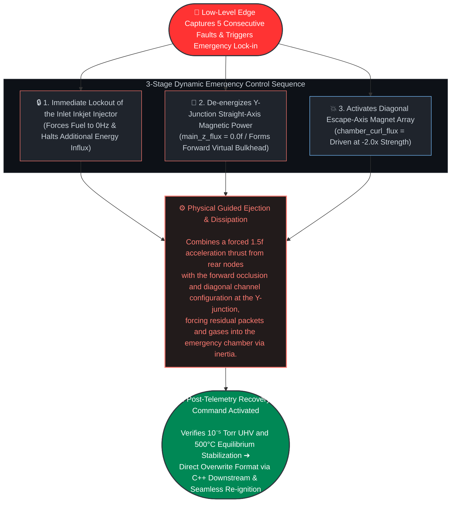

# Discrete Filament Router (DFR V3) - Emergency Contingency & Dynamic Flush Protocol Specification

## Overview
This document defines the physical execution and layered control interlock specifications of the "3-Stage Dynamic Digital Flush Sequence," which activates autonomously at the silicon edge upon detecting critical anomalies within the closed-loop linear confinement structure—such as upstream node disconnection, localized thermodynamic equilibrium collapse, or plasma trajectory deviation.

The primary objective of this protocol is to immediately isolate faulty nodes and execute a real-time, non-disruptive system reset (Soft Reset) without causing structural component wear or permanent degradation of the baseline vacuum, thereby guaranteeing 24/7/365 High Availability (HA).

*   **Physical Confinement Infrastructure Specification:** Adopts a linear cylindrical loop conduit structure with a cross-sectional diameter of $\varnothing$ 60cm and a total length spanning 100 to 200 meters.
*   **Kinematic Vacuum Corridor Margin:** Enforces an ultra-high vacuum (UHV) buffer margin of $\ge$ 30cm in all directions relative to the central axis during nominal packet travel. This provides a safe spatio-temporal buffer, allowing low-level computations and actuators to react before an anomalous packet collides with the physical first wall during emergency sequences.
*   **Emergency Inertial Egress Mechanism:** Upon fault generation, the low-level silicon kernel triggers a hardwired phase modulation that simultaneously executes a forced 1.5f acceleration thrust (Push) on rear nodes, completely de-energizes the magnetic field along the straight axis of the Y-junction chamber node (forming a 0.0f virtual bulkhead), and powers the diagonal escape-axis magnet arrays. This re-routes the packet's intrinsic forward momentum, forcing a sharp directional shift into the emergency dissipation chamber to isolate and exhaust residual debris.

---

## 1. 3-Step Dynamic Emergency Execution Sequence

As soon as the lowest-level silicon edge (Layer 1) kernel registers an upstream node termination token (-99.0f) or a floating-point exception (NaN/overflow) for 5 consecutive cycles, it triggers an emergency lock-in. The system then concurrently and deterministically executes the following 3-stage independent sequence across all upper and lower layers.

### [Stage 1] Injection Intercept: Immediate Lockout of the Inlet Inkjet Injector
*   **Physical Mechanism:** Upon the arrival of an upstream termination token (-99.0f) or an IEEE 754 NaN/range-exceeded overflow induced by sensor disconnection or line breakage, the branchless bit-adder calculation pipeline inside the lowest-level silicon edge (Layer 1) kernel instantly detects the anomaly.
*   **Control Execution:** As soon as the low-level chipset autonomously registers an emergency lock-in due to 5 consecutive fault accumulations, this flag is injected into the Layer 3 orchestrator via the Layer 2 C++ zero-copy data conduit. The Layer 4 macro-cognitive inference brain, which passively scans the global telemetry stream, captures this state and immediately modulates the injection frequency of the inlet micro-nozzle array down to **0Hz** via a master interrupt, freezing fuel influx and halting further external energy introduction.

### [Stage 2] Line Isolation: Forward Virtual Bulkhead Formation & Escape-Axis Activation
*   **Physical Mechanism:** Within the residual fluid flow inside the 1D linear track loop, this stage electromagnetically isolates and blocks anomalous packets from entering the failed sector while establishing a detour pathway. Concurrently, it limits the stagnant flux of the lithium gas jacket—which spikes rapidly due to packet radiant heat—completely trapping and confining global ultra-high vacuum (UHV) domain contamination within the boundaries of the electromagnetic bulkhead walls.
*   **Control Execution:** Y-junction node chipsets, whose hardware ceramic pin configurations are bound to `is_chamber_node == 1`, cross-control their independent dual-port drivers immediately upon emergency lock-in without waiting for upper-level network command latencies. The Z-axis straight magnet intensity, which enforces nominal forward confinement, is instantly de-energized to **main_z_flux = 0.0f**, establishing a forward virtual bulkhead. Simultaneously, a separate diagonal magnetic coil array mapped toward the emergency chamber axis is driven with an inverse overvoltage of **chamber_curl_flux = -curl_pred * 2.0f**, equivalent to twice the negative magnitude of the nominal predicted phase curve.
*   **Valve Control Specification (Interlocked with Physics_note.md 4-2):** In parallel with the electromagnetic trajectory translation pipeline, a digital LOW signal is hardwired-injected at nanosecond (ns) speeds into the hardware actuator register pins of the variable throttle valve at the failed sector inlet. This forces an immediate lock-in to **$\xi_{\text{valveOpenRatio}} = 0.0$ (Full Occlusion)**, binding the virtual bulkhead and the micro-vacuum isolation circuit at the silicon fabric level.

### [Stage 3] Deterministic Push-Flush: Global Normal Node Forced Propulsion Wave Injection
*   **Physical Mechanism:** To prevent residual plasma sub-particles and stagnant lithium gas debris from remaining inside the conduit and thermally damaging the inner walls, the system shifts from its nominal 50Hz AC control to a fixed, forward-accelerating propulsion injection wave.
*   **Control Execution:** All magnet nodes designated as normal sectors via hardware pin markings (`is_chamber_node == 0`) halt their 50Hz sine-wave phase-shift control immediately upon emergency lock-in. Instead, they force the GaN/SiC power semiconductor switching nodes to shift the straight-axis magnetic field to a fixed maximum acceleration output of **main_z_flux = 1.5f**, emitting a powerful rear flush propulsion wave. The material swept from the pipeline by this propulsion wave is guided along the diagonal magnetic field guide opened by the junction node, channeling it directly into the liquid lithium condensation interface inside the emergency dissipation chamber.

---

## 2. Hardware/Software Layered Role Mapping

This emergency protocol maps and executes the physical infrastructure resources and the four software control layers defined in `System_Specs.md` as follows:

### 1. Layer 4 (Macro Cognitive Inference & Load Following)
*   **Background Scan:** Executes a passive scan on a **2.0-second cycle** based on macro-level temperature and pressure distribution telemetry.
*   **Emergency Intercept:** Upon receiving an emergency alert, immediately modulates the inkjet injector driving frequency down to a **0Hz** master interrupt to cut off fuel influx.
*   **Integrated Dissipation Control:** Once post-fault piping maintenance is complete, orchestrates the autonomous dissipation systems within an environment strictly isolated from JIT compilation jitter.

### 2. Layer 3 (Global Orchestration)
*   **Disconnection Token Detection:** Utilizes an asynchronous `asyncio` event loop-based passive listening mechanism to detect the absolute node disconnection token (-99.0f) from the low-level silicon edge in real time.
*   **Voltage Drop Mitigation:** Upon token detection, performs a "Lattice Surgery" by instantly applying virtual grid masking (`active_lattice_mask = False`) to prevent cascading voltage drops.
*   **C++ Bridge Driver Binding:** Once the post-fault vacuum dissipation state stabilizes, binds with the Layer 2 C++ bridge driver to atomically initialize low-level register emergency flags and command a soft reset.

### 3. Layer 2 (Hardware-Software Bridge)
*   **CPU Pipeline Optimization:** Deploys C++20 `[[unlikely]]` exception guards to eliminate nominal runtime CPU pipeline jitter within the primary driving path.
*   **Memory Lifecycle Control:** Implements a `py::capsule` lifecycle safety fence to fundamentally block the Python Garbage Collector (GC) from arbitrarily deallocating or modifying physical hardware register address spaces.
*   **High-Speed Data Path:** Maintains a zero-copy high-speed data path that maps physical silicon addresses directly to a NumPy master structure pointer view, bypassing copying overhead.

### 4. Layer 1 (Hardware Silicon Edge Kernel)
*   **Emergency Lock-in Transition:** Utilizes a condition-free, branchless bit-masking pipeline (`uni_branchless_select`) to instantly transition the system into an emergency lock-in state **upon 5 consecutive fault detections**.
*   **Numerical Divergence Mitigation:** Prevents numerical divergence during catastrophic transients by applying a Padé notch filter paired with a Joseph-form shielding barrier variable (`p00_shield`).
*   **Real-Time Preemptive Control:** Preemptively applies control signals at a **near-0ns latency threshold** dictated by the hardware ceramic pin configuration:
    *   **Standard Nodes:** Emits a fixed 1.5f acceleration propulsion wave and executes full occlusion (0.0) of the variable throttle valve.
    *   **Chamber Junction Nodes:** De-energizes the straight-axis field (forming a 0.0f forward virtual bulkhead) and drives diagonal escape-axis magnet arrays at a -2.0x inverse magnitude.
    
### 5. Physical Infrastructure
*   **Kinematic Vacuum Corridor:** Secures an ultra-high vacuum (UHV) buffer margin of **$\ge$ 30cm in all directions** relative to the center axis, ensuring a spatio-temporal buffer for packet dissipation before any physical first-wall collision.
*   **High-Speed Suction Ports:** Separates and extracts highly charged helium ash impurities in real time via high-speed suction ports embedded within a 10–20cm physical structural layout clearance.
*   **Gas Condensation & Reduction:** Rapidly condenses and returns vaporized lithium gas through phase-change phenomena occurring at Physical Shell 2 (the GlidCop-cooled boundary layer) inside the emergency dissipation chamber.

---

## 3. Post-Flush Cleaning & Seamless Re-ignition Protocol

Once the emergency guided ejection concludes, the top-level Layer 3 and Layer 4 control centers enforce the following **4-step recovery interlock** to restore the lowest-level silicon fields—which had been frozen in acceleration lock-in mode—back to nominal operations.

### Step 1: Telemetry Vacuum Post-Verification
After closing the emergency chamber branch, the Layer 3 orchestrator asynchronously scans the baseline partial pressure of the suction ports inside the vacuum buffer corridor. It provides the final verification of whether all residual hazardous gases have been completely exhausted and an ultra-high vacuum (UHV) equilibrium has been re-established.
*   **Target Specification:** $\le 10^{-5}\text{ Torr}$ (Standard UHV Baseline)

### Step 2: Thermal Equilibrium Recovery
The Layer 4 cognitive inference brain monitors the global temperature profile of Physical Shell 2 (the GlidCop outer-wall copper layer). It confirms that localized heat spikes have dissipated and that the entire system has successfully returned to its baseline thermal conduction equilibrium.
*   **Target Temperature:** ~500°C

### Step 3: Top-Down Atomic Register Overwrite
Once the vacuum levels and temperatures are confirmed to be within their nominal thresholds, the Layer 3 orchestrator directly accesses the physical address space via PCIe BAR shared memory, routing through the Layer 2 C++ high-speed top-down pipeline (`trigger_hardware_reignition_conduit`). Under a strict hardware memory barrier enforced via volatile directives to prevent compiler optimization from stripping out commands, the orchestrator atomically flushes and formats the emergency flags and variable valve address spaces inside the lowest-level silicon registers within a single clock cycle.
*   **Target Registers for Initialization:** `fail_counter`, `is_emergency_on` flags, and variable throttle valve opening rate registers.
*   **Control Methodology:** Direct, atomic overwriting with 0 and nominal baseline specification parameters.
*   **Variable Valve Relaxation Specification (Layer 2 C++ / Layer 3 Interlock):** In tandem with the magnet register recovery, the variable throttle valve hardware register space—previously frozen in full occlusion—is concurrently overwritten with its nominal operational baseline of **1.0f (100% Fully Open)**. This guarantees that newly injected plasma packets immediately post-reignition enter a completely restored **$(5.17 \times 10^{-5}\text{ Torr})$** lithium jacket confinement tunnel, achieving strict homeostatic transport without encountering fluidic resistance bottlenecks or pressure stagnation.

### Step 4: Seamless Forward Re-ignition (Soft Re-ignition)
Simultaneously with the silicon register formatting, all normal magnet sectors halt their forced acceleration propulsion wave (1.5f) and transition back into their fixed-phase traveling orbital cycles. Concurrently, the Layer 4 homeostasis kernel tower executes a soft release on the inlet inkjet injector frequency, seamlessly resuming continuous power generation.
*   **Magnet Node Control:** Synchronizes to a steady-state 50Hz sine-wave traveling cycle relative to neighboring nodes (No Global Clock).
*   **Inkjet Frequency Transition:** 0Hz $\rightarrow$ Nominal Operating Threshold (5 kHz to 15 kHz)

## 4. Expected Benefits

*   **Reduced Maintenance Overhead:** By swiftly isolating failures before the physical first wall suffers wear or catastrophic damage, the architecture dramatically cuts down on device disassembly, decontamination, and component replacement costs during anomalous events.
*   **Guaranteed Plant Uptime:** As soon as the ultra-high vacuum (UHV) cleanliness within the vacuum buffer corridor is validated post-flush, the inkjet injector instantly restarts. This maximizes the power plant's operational availability, ensuring long-term profitability.

