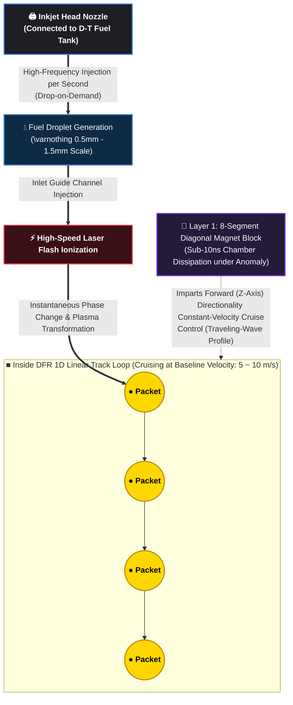

# Discrete Filament Router (DFR V3) - Nominal Steady-State Operational Specification

## Overview
This document defines the nominal electromagnetic confinement and hardware topology operational specifications required to realize the 24/7/365 Continuous Steady-State Stream defined in `system_comparison.md`.

By leveraging the structural angle margins of an 8-segmented electromagnetic block diagonally inclined forward, this system is designed to physically buffer against electromagnetic stagnation and low-level computational bottlenecks inherent to linear propulsion configurations via pure geometric optimization.

---

### Nominal Staging & Homeostatic Physics Guidelines

*   **[Ultra-Initial Thermal Sequence]:** To prevent structural freezing and fluidic occlusion of the liquid-metal cushioning barrier (eutectic Li-Pb alloy) during ultra-initial startup, and to initiate controlled vaporization, the Layer 4 homeostasis kernel fires the `trigger_system_warmup` routing to preemptively preheat the conduit to a baseline thermal state between **250°C and 300°C**.
*   **[Traveling-Wave Based 3D Magnetization Confinement]:** The core objective of the electromagnetic control loop is not forced volumetric compression, but the cross-coupling of the plasma packet’s intrinsic transverse **Self-Pinch compressive force** with the forward **propulsive thrust** of the Z-axis traveling magnetic fields injected by the magnet blocks. This dual coupling guarantees the 1D linear trajectory stability of high-frequency plasma packets based on traveling wave mechanics.
*   **[Self-Regulating Vapor Shielding Cushion]:** The lithium gas shell spontaneously generated by the residual thermal fields of preceding packets forms an exponential vapor thrust barrier that intensifies as a packet deviates closer to the physical first wall, functioning as a synchronized electromagnetic and thermodynamic compression cushion.
*   **[Pulsating Pure Inertial Drift Windows]:** Distributed between the primary magnet rings are **10cm to 20cm pure inertial drift corridors** that provide a numerical pulsation window (Pulsation Window) to prevent self-pinch constraints from over-compressing and diverging into localized macro-turbulences. Within these gaps, packets undergo uniform linear inertial flight at velocities of 5 to 10 m/s for approximately 20ms before being realigned by the subsequent magnet ring.

---

## 1. Bypassing Three Primary Hardware Bottlenections via Diagonal Angle Margins

### 1.1 Electromagnetic Overlap Control (Magnetic Field Overlap)
In conventional linear accelerators and vertical electromagnetic propulsion systems, configuring the magnet engagement angle vertically (90°) induces electromagnetic stagnation caused by magnetic field interference or discontinuity at the boundary where a preceding block de-energizes and a succeeding block activates.
*   **Continuous Flux-Line Tunnel:** The 8-segmented electromagnetic blocks of this system project magnetic flux vectors in a forward diagonal direction (an inclined elevation angle of $3^\circ \sim 5^\circ$). This configuration allows the trailing edge of the magnetic field generated by each individual block to physically overlap (Overlap) with the confinement zone of the subsequent block.
*   **Jitter and Back-EMF Elimination:** Before the preceding block's magnetic field completely decays, the diagonal vector of the succeeding block preemptively synchronizes with the incoming plasma packet and its insulating physical shell zone. As a result, current jitter (Jitter) and Back-EMF (Back-EMF) bottlenecks traditionally generated during cascaded switching sequences are neutralized, allowing the packet stream to maintain a deterministic and continuous fluidic flow (Continuous Flow).

### 1.2 Latency Margin Securing: Dilation of Temporal Phase-Shift Windows
If magnet rings are driven vertically based on mutually independent global timing clocks (Global Clock), the system is forced into a nanosecond (ns) hardware timing interlock (Dynamic Interlock) tied strictly to real-time packet velocity tracking as it passes the coil centerpoint. This constraint introduces severe computational overhead and synchronization jitter at the silicon edge.
*   **Spatial-Temporal Phase Translation Mapping:** This system entirely eliminates a global centralized timing clock. Instead, the $n$-th node and $(n+1)$-th node adopt a constant-velocity cruise profile, passing only a **50Hz fixed phase shift (Phase Shift)** via an asynchronous neighboring grid mesh (Mesh) communication network. Here, the diagonal inclination angle establishes a spatially extended magnetic overlap zone (Overlap Zone) along the axial path, securing a spatial margin for the flux-line profile itself.
*   **Grid Synchronization Load Dissipation:** Because the diagonal flux-line couples to the next node within a control window determined by the packet's forward velocity ($5 \sim 10\,\text{m/s}$), the Layer 1 hardware kernel and Layer 2 C++ data conduit pipeline are liberated from dynamically computing real-time variable switching latencies. Operating under a fixed 50Hz sinusoidal rhythm, the deterministic time window (Time Window) required to maintain the neighbor-to-neighbor phase sync clock and safely toss the electromagnetic pulsation signal relaxes down to the microsecond ($\mu\text{s}$) domain. This completely protects switching devices from thermal degradation and eliminates timing jitter at the source.

### 1.3 Geometric Isolation of Reverse Electromagnetic Leakage (Crosstalk)
Vertically aligned high-frequency linear coil systems are inherently vulnerable to crosstalk (Crosstalk) bottlenecks, where fast electromagnetic pulses from a preceding block inductively generate parasitic currents in succeeding coils, causing critical burnouts in the Layer 1 high-speed semiconductor layers or disrupting precision control signaling.
*   **Directional Geometric Filter:** The magnetic flux vectors of the 8-segmented magnet blocks are geometrically aligned to inject exclusively in the forward diagonal direction, topologically blocking electromagnetic noise and energy backflow toward the upstream (Upstream) sectors.
*   **Independent Control Separation:** This geometric isolation mechanism ensures that even during abrupt and aggressive adjacent block switching, the upstream Layer 1 control kernels remain uncoupled from electromagnetic cross-interference, maintaining independent high-speed calculation pipelines entirely free of branch bottlenecks (Branch Bottleneck).

---

## 2. Nominal Steady-State Control Loop Specification

The nominal steady-state operational parameters of this confinement infrastructure interlock with the software control layers specified in `System_Specs.md` to sustain continuous homeostasis as follows:

1.  **Layer 4 (Homeostasis Kernel) Macro Orchestration:** Monitors the macro-level temperature profiles of Physical Shell 2 (the entire outer boundary of the piping) and runs the traveling-wave cycle of the magnet ring array at a **fixed 50Hz baseline frequency**. By evaluating external grid demands and thermodynamic equilibrium states, it deterministically modulates only the inlet inkjet injection frequency (Hz) dial, autonomously controlling the spatial cruising margins between internal packets within a macro-homeostasis zone (**Homeostasis Lock**).
2.  **Layer 1 & Layer 2 Static Phase-Rhythm Cruise:** The magnet control system is entirely emancipated from dynamically calculating real-time variable pulses or executing dynamic triggers at nanosecond (ns) latencies to match minute changes in packet transit velocity [1.2]. The lowest-level silicon edge (Layer 1) kernel and the accelerator data pipeline (Layer 2) run exclusively on a **50Hz sinusoidal constant-velocity cruise rhythm based on a fixed phase-shift tossing mechanism (Fixed Phase-Shift Tossing)** between the $n$-th and $(n+1)$-th nodes, bypassing a global master clock. This completely eliminates transient current overloading and timing jitter at the source, guaranteeing the long-term operational lifespan of the embedded GaN/SiC power semiconductor switching elements integrated within Physical Shell 1.

---

## 3. Comprehensive Nominal Operational Benefits (Operational Stability)
*   **Minimization of Hardware Stress:** The forward diagonal overlap architecture relaxes nanosecond-range (ns) control execution constraints while simultaneously dissipating back-EMF and crosstalk, fundamentally preventing physical component degradation and hardware fault generation triggers.
*   **Realization of an Ideal Thermal Conduction Matrix:** Because packets sustain a uniform constant-velocity cruise profile completely clear of electromagnetic stagnation bottlenecks, the self-regulating compression effects of the lithium vapor shield and the combined radiative-conductive heat exchange into Physical Shell 2 (the GlidCop absorption core) maintain a uniform macro steady-state (Macro Steady-state) entirely devoid of localized thermal spikes (Heat Spikes).

---

## 4. Axial Pipeline Direction (Z-Axis) Stepping-Stone Magnet Block Topology

This system intentionally rejects continuous magnetic coil placement, instead adopting a stepping-stone topological layout that distributes physical gaps between the 8-segmented diagonal electromagnetic blocks. This architecture weaponizes the intrinsic inertial momentum (uniform linear motion) of the plasma packets to maximize hardware structural longevity.

### 4.1 Stepping-Stone Orbital Topology Diagram

Along the axial pipeline trajectory (Z-axis), the 8-segmented forward-diagonal electromagnetic blocks and the pure inertial drift corridors are sequentially and alternatingly mapped.

```mermaid
graph LR
    %% Style Guide Definition
    classDef magnet fill:#241A3A,stroke:#7C3AED,stroke-width:2px,color:#fff,font-weight:bold;
    classDef vacuum fill:#0F2416,stroke:#1E7E34,stroke-width:2px,color:#fff,font-weight:bold,stroke-dasharray: 5 5;
    classDef packet fill:#FFD700,stroke:#B8860B,stroke-width:2px,color:#000,font-weight:bold;

    %% Main Stepping-Stone Node Architecture
    subgraph DFR_Z_AXIS ["■ DFR 1D Axial Pipeline Direction (Z-Axis) Stepping-Stone Topology Layout"]
        direction LR
        
        M_N["🧲 Magnet Block N<br>(8-Segment Confinement/Propulsion)<br>[Field ON / Acceleration]"]
        V_N["🌌 Pure Inertial Drift Corridor<br>(10cm ~ 20cm Margin)<br>[Field OFF]"]
        M_N1["🧲 Magnet Block N+1<br>(8-Segment Realignment)<br>[Field ON / Acceleration]"]
        V_N1["🌌 Pure Inertial Drift Corridor<br>[Field OFF]"]
        
        %% Packet Flow Visualization
        P1(("●")) --- M_N ---> P2(("●")) ===> |"Uniform Linear Inertial Flight<br>(Velocity: 5~10 m/s)"| V_N ===> P3(("●")) --- M_N1 ---> P4(("●")) ==> V_N1
    end

    %% Apply Node Styles
    class M_N,M_N1 magnet;
    class V_N,V_N1 vacuum;
    class P1,P2,P3,P4 packet;

```

---
### 4.2 Three Primary Physical Advantages of the Stepping-Stone Architecture

#### ① Zero Electric Consumption & Zero Electromagnetic/Thermal Fatigue (Zero Fatigue Zone)
*   **Physical Phenomenon:** After a plasma packet passes through the 8-segmented diagonal electromagnetic block N—securing forward diagonal propulsive thrust and central-axis confinement magnetic force—it enters a zero-field state where no external force is applied for a 10cm to 20cm segment before reaching the subsequent 8-segmented diagonal electromagnetic block N+1.
*   **Engineering Benefit:** In accordance with Newton's First Law of Motion, the packet undergoes uniform linear inertial flight through this vacuum corridor corridor at its baseline velocity (5 to 10 m/s). While traversing this gap, power to the magnet coils and power semiconductor layers (GaN/SiC) is shut off, suppressing thermal accumulation and electromagnetic fatigue to near 0%, thereby mitigating system degradation stress.

#### ② Adiabatic Expansion-Compression Stabilization via Inkjet Injection Rate (Hz) Modulation
*   The vacuum buffer corridor, completely devoid of continuous electromagnetic fields, provides a microscopic margin for the controlled adiabatic expansion of the plasma packets.
*   Before the packet can diffusely diverge within this inertial drift zone, it is captured by the forward diagonal electromagnetic trajectory vectors of the subsequent magnet ring N+1, executing a confinement re-compression cycle. This suppresses the turbulent transition of the plasma fluid and sustains a stable, pulsating (Pulsation) macro steady-state profile.

#### ③ Securing Geometric Channels for Vacuum Exhaust & Fluidic (Helium Ash) Circulation
*   **Engineering Infrastructure:** The **10cm to 20cm physical clearance gap** secured via the stepping-stone layout is utilized to route ultra-high-speed heat exchange piping within Physical Shell 2 (the GlidCop intermediate absorption core). Simultaneously, this space serves as an integration hub for high-speed vacuum suction ports, helium gas separation collectors, and telemetry sensors monitoring the inner wall temperature of Physical Shell 2.

---

## 5. Organic Interface with Layer 4 Software & Macro Management Scenarios

The highest-level orchestration deck, the Layer 4 Homeostasis Kernel Tower, monitors the plant-wide physical states via a 2.0-second background passive scan and dynamically modulates the inlet injection density.

*   **Layer 4 Telemetry Monitoring:** Validates that the global macro-level temperature profile across Physical Shell 2 stably maintains its designed baseline thermal conduction equilibrium at approximately **500°C**.
*   **Macro Control Dialing:** In alignment with rising load-following (Load Following) coefficients from the external power grid, it injects high-frequency firing commands (up to a 15 kHz ceiling frequency) into the inkjet injector, operating within a safety fence strictly isolated from JIT compilation jitter.
*   **Physical Outcome:** Discrete plasma packets enter the 1D linear trajectory at highly dense intervals, maximizing radiant thermal flux. The lowest-level silicon edge (Layer 1) and hardware bridge (Layer 2) data pipelines sustain packet transit velocity at its baseline state (5 to 10 m/s) via an asynchronous neighboring mesh communication network without a global master clock. This spikes the spatial packet density, scaling up the facility's total net power generation.

