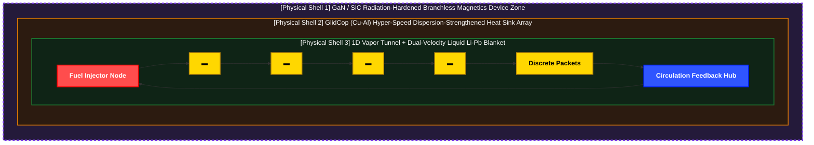

# Discrete Filament Router (DFR) - Technical System Specification

## Introduction & Physical Hypothesis

This system originates from analyzing the natural phenomenon of ball lightning (Ball Lightning) as a **temporary equilibrium mechanism where chemical dust combustion energy and external electromagnetic confinement fields cross-couple to sustain a spherical topology**. The objective of this technology is to synthesize, scale, and sustain this confinement phenomenon within an artificial linear structure at a microscopic level by integrating it with a high-frequency inkjet injection architecture.

An array of micro-nozzles embedded within a closed-loop linear confinement structure (Containment Structure) continuous-fires ultra-minute fuel projectiles at high frequencies, while forward-diagonal electromagnetic forces are applied to establish strict directionality for the linear filament stream.

During this process, the internal liquid metal cushioning barrier (Fluid Cushion) undergoes rapid thermal vaporization driven by the forward-cruising, high-energy plasma packets. This spontaneously generates a protective, isolating physical shell (Shell) composed of lithium vapor around the plasma core. Following this self-assembly, the system real-time modulates the external electromagnetic arrays to fine-tune the confinement state of this lithium gas shield with micro-scale precision.

The system does not chemically combust nuclear fuels. Rather, its primary objective is to **thermally insulate (Thermal Insulation) and electromagnetically reflect (Reflection) high-frequency injected plasma packets using the lithium gas jacket, maximizing the intrinsic high-energy state and confinement longevity of the plasma fluid within a linear loop**. This forces a plasma core that would traditionally breach critical stability thresholds into a stable, non-disruptive macro steady-state (Steady-state) restricted entirely to the linear filament loop trajectory.

---

## 1. Physical Hardware Topology & Multi-Layered Architecture (Topological Field Design & Multi-Shield Directionality)

To overcome the massive three-dimensional volumetric control constraints inherent in conventional Tokamak methodologies, this physical facility maps the plasma confinement zone into a streamlined **1D linear trajectory loop (1D Linear Trajectory Loop)**.

This linear containment structure (Containment Structure) acts as a multi-layered matrix (Multi-layered Matrix) that physically and electromagnetically seals the internal high-energy plasma filament trajectory. The inner walls of the structure are stratified into a liquid metal cushioning barrier, a vaporized isolating physical shell, and an outer electromagnetic induction coil array, delineating the physical specifications of the hardware confinement matrix.

Consequently, this layout drastically reduces the system's control dimensionality. This structural simplification ensures that the control core—spanning from the low-level silicon edge up to the highest inference tower—can stably execute real-time modulation and dynamic equilibrium orchestration.

### 1.1 Boundary Structural Dimensions
*   **Core Transit Channel:** A closed single-tube conduit optimized for micro-bunching trajectory stabilization.
*   **Effective Packet Diameter:** A train of micro-filament packets scaled to a diameter of $\varnothing$ 0.5mm – 1.5mm.
*   **Dynamic Vacuum Corridor:** Secures a confinement buffer margin of $\ge$ 30cm in all directions to absorb transient kinematic perturbations and fundamentally eliminate physical first-wall contact.

### 1.2 Multi-Tier Material Shell Specifications
*   **Physical Shell 3 (Kinematic Transport Boundary Layer / Shell 3):** A **liquid lithium-lead (Li-Pb) alloy thin-film barrier** flowing with a thickness of 3mm–5mm atop a Tungsten-Copper Functionally Graded Material (W-Cu FGM) substrate. It spontaneously generates an evaporative *Vapor Shielding* cushion to neutralize localized non-linear heat spikes.
*   **Physical Shell 2 (Thermodynamic Energy Recovery Core / Shell 2):** A high-density **GlidCop (Cu-Al)** heat-sink tube array. It drives a complex thermal extraction grid engineered to achieve a target **hybrid energy recovery efficiency of 60% - 70%**.
*   **Physical Shell 1 (Peripheral Electromagnetic Execution Zone / Shell 1):** A sealed, radiation-hardened independent segment populated with high-speed **GaN/SiC power semiconductor switching nodes**. It is hardwired directly to the Layer 1 hardware kernel and the Layer 2 C++ branchless MUX circuits. Upon upstream fault capturing, it executes instantaneous magnetic field computational compensation and a 0ns register wire injection in **under 10 nanoseconds (sub-10ns)**. (This indicates that the register overwrite overhead approaches absolute zero; it does not dictate the physical charging time constant of the power inductors themselves.)

---

## 1.3 Comprehensive 6-Tier Physical Barrier Specifications

The continuous 1D trajectory loop is engineered using a 6-tier sandwich architecture. This structural layout shifts the primary burden of plasma confinement away from continuous external magnetic control, transferring it into a self-regulating, boundary-driven thermodynamic and magnetohydrodynamic equilibrium framework.

### 📊 Physical Barrier Specification Matrix

| Barrier Name | Density / Margin Spec | Primary Material Component | Detailed Physical Mechanics & Functional Role |
| :--- | :--- | :--- | :--- |
| **Deepest Core Axis** | Diameter: 1mm - 2mm | D-T Plasma Train (Deuterium-Tritium) | Cruises along a low-speed drift trajectory at velocities of 5–10 m/s under a 100M K thermal profile, sustaining 1D linear alignment. Rejects explosive volumetric expansion in favor of a ball-lightning-inspired discrete packet combustion paradigm governed by electrostatic surface tension. Leverages the self-repulsive vapor thrust of the fluid cushion paired with external electromagnetic forces to compress core plasma density ($n$), systematically driving the system toward the Lawson Criterion boundary. |
| **Vacuum Buffer Corridor** | Radius: $\ge$ 30cm margin | Ultra-High Vacuum State (UHV State) | Secures a reliable latency buffer (Latency Buffer) that gives low-level calculations and hardware actuators ample time to react before localized plasma kinks or high-frequency micro-instabilities can breach the physical structure perimeters. This vacuum blanket fundamentally blocks conductive and convective heat transfer, thermally insulating the 1–2mm core filament to sustain ultra-high core temperatures completely independent of transit distance (Dewar flask effect). |
| **Fluid Cushion Barrier** | Nominal Steady-State Flowing Thin-Film Mean Thickness: 3.0mm - 5.0mm | Liquid Lithium-Lead Eutectic Alloy (Liquid Li-Pb Eutectic Alloy) | Acts as the innermost dynamic boundary interface directly exposing the vacuum corridor. Captures high-speed fusion neutrons to breed tritium internally as a replenishable fuel source, while operating as a self-healing thermal buffer jacket. Upon localized extreme heat-flux transients, the lithium vaporizes spontaneously to establish an isolating *Vapor Shielding* cushion. This multidirectional vapor front diffuses radiant energy isotropically, organizing a self-regulating, non-linear electromagnetic and magnetohydrodynamic repulsion basin that intensifies as a plasma packet drifts closer to the perimeter, shielding the solid first-wall from direct contact.  **[MHD Loop Cycle]** $\text{[Continuous Radiation Absorption]}\rightarrow \text{[Spontaneous Li Vaporization]}\rightarrow \text{[Vapor Shield Cushion Assembly]}\rightarrow \text{[Condensation via Shell 2]}\rightarrow \text{[Fluidic Loop Recirculation]}$ |
| **Physical Shell 3 (First-Wall Surface)** | 60% - 65% Variable Porosity Lattice Topology | Tungsten-Copper Functionally Graded Material (W-Cu FGM) | Serves as a porous physical substrate providing foundational structural backing to the inner fluid cushion flow. Induces and dissipates the residual impact vectors of incoming high-energy plasma particles that penetrate or slide along the fluid layer into low-angle diagonal sliding vectors (shear vectors) rather than vertical collisions. Functions concurrently as a non-consumable diagnostic mesh that intercepts primary electromagnetic displacement telemetry metrics. |
| **Physical Shell 2 (Intermediate Layer)** | $\ge$ 95% Ultra-High-Density Extruded Conduit Array | Copper-Alumina Dispersion-Strengthened Alloy (GlidCop) | Maximizes structural thermal conductivity to harvest high-flux thermal energy instantly (acting as a high-capacity heat sink) and routes it directly to external gas turbine power cycles. The vaporized lithium molecules filtering through the lattice channels of Physical Shell 3 and impacting the cooled boundary interface of Physical Shell 2 undergo a rapid phase-change condensation, returning to a liquid state and dropping into the lower collector array to close the continuous lithium capture loop and supply the inner fluid cushion. |
| **Physical Shell 1 (Peripheral Backing)** | 95% - 99% Radiation-Hardened Hermetic Shielding Structure | Ceramic Grid Matrix + GaN/SiC Power Semiconductors | Formulates an electro-deposited zone dedicated to low-power embedded hardware. Connected directly to the Layer 1 hardware kernel and the Layer 2 branchless data conduit, it embeds a decentralized control architecture engineered to execute deterministic, branchless MUX predictive magnetic pulses within a single clock cycle, tolerating zero timing jitter. |

---

#### Layer 4 (Macro Cognitive Inference & Load Following): Homeostasis Kernel Tower

*   **Structural Positioning:** A top-down intelligent command deck physically and temporally isolated from the real-time magnet driving and hyper-speed acceleration pipeline (Hot Path) to orchestrate long-term structural safety and net power output based on global telemetry streams.
*   **Macro Inference & Load Following:** Passively scans the global thermodynamic states—tracking the pipeline mean target temperature (~500°C)—and the external power grid demand profile on a 2.0-second background cycle. It organically regulates total plant output by deterministically modulating the inlet inkjet injection frequency dial between 5 kHz and 15 kHz.
*   **Vacuum-Thermodynamic Hybrid Inference:** Enforces strict architectural compliance with the `Physics_note.md` [4-2] specification. It monitors the real-time average opening ratio ($\xi_{\text{avg}}$) of the variable throttle valves across all 16 independent magnet sectors, capturing fluidic stagnation bottlenecks if the vacuum suction conductance clearance margin drops below 80% ($\xi_{\text{avg}} < 0.8$).
*   **Homeostasis Lock Execution:** Upon capturing pipeline overheating transients (breaching the 520°C ceiling) or the aforementioned vacuum conductance bottleneck, the kernel immediately drops the fuel injection frequency to its 5 kHz minimum floor configuration (`HZ_MIN`) without causing plant downtime or abrupt emergency facility shutdowns. This induces a rapid decrease in localized thermal/vacuum loads, executing a deterministic homeostatic stabilization lock (**Homeostasis Lock**) that preemptively averts pipeline failures and catastrophic pressure explosions.
*   **Jitter Disruption Defense:** By decoupling intensive macro-data calculations and high-level inference routines into 2.0-second background asynchronous tasks, the architecture fundamentally blocks micro-jitters—induced by Python runtime operations or garbage collection cycles—from propagating into the underlying low-level real-time bare-metal execution path.

#### Layer 3 (Global Orchestration): Asynchronous Post-Flush Recov-Orchestrator

*   **Structural Positioning:** An asynchronous software backbone deployed atop the lowest physical silicon edge (Layer 1) and hardware bridge (Layer 2) tiers to manage macro-level exception states and execute physical pipeline recovery sequences.
*   **Asynchronous Telemetry Polling:** Leverages a native `asyncio` non-blocking event loop to drive a bottleneck-free passive listening mechanism that captures absolute node disconnection and hardware fault tokens (-99.0f) emitted independently by the low-level silicon wires in real time.
*   **Lattice Surgery:** Immediately upon registering a sector fault token, the engine swaps the corresponding virtual grid active mask (`active_lattice_mask`) to False and completes routing synchronization to the isolation trajectory. This topologically protects the unsegmented 1D linear track corridor from cascading voltage drops and grid phase perturbations.
*   **Asynchronous Decay Waiting:** During emergency shutdown protocol executions, the loop binds tightly with the branchless mathematical engines inside the Layer 2 C++ extension modules. By inversely calculating the variable exponential decay rate locked to the current valve opening ratio, it autonomously evaluates and enforces a safe waiting buffer based on the fluidic causality constraint (CFL condition): $t_{\text{wait}} = \frac{5}{\text{decay}\_\text{rate}}$.
*   **Post-Flush Recovery:** Asynchronously waits for anomalous plasma packets and stagnant debris to inertially eject into the emergency bypass chamber, then modulates the vacuum suction pumps to aggressively restore the baseline pipeline vacuum level to the fusion-grade baseline of $10^{-5}\text{ Torr}$ ultra-high vacuum (UHV) and a 500°C steady-state equilibrium profile.
*   **Downstream Re-ignition Binding:** Drives the Layer 2 C++ bridge infrastructure mapped directly to the actual PCIe BAR and shared memory physical address spaces of the 16 independent magnet sectors. In tandem with emitting a recovery injection at the fault locus, it atomically overwrites the variable throttle valve register—previously frozen in full occlusion (0.0)—back to its nominal baseline specification of **1.0f (100% Fully Open)**. This ensures that even post-fault, all downstream cascading sectors cleanly converge back to a "STEADY" baseline profile, reliably securing global re-ignition integrity.

#### Layer 2 (Hardware-Software Bridge): C++ Accelerator Bridge Conduit

*   **Structural Positioning:** A pure embedded data pipeline (Conduit) that interconnects the lowest-level physical silicon edge (Layer 1) with the upper global orchestration tier (Layer 3) at absolute zero communication latency.
*   **0ns Zero-Copy Register Interception:** Utilizes a Pybind11 capsule lifecycle safety fence (`py::capsule`) paired with a NumPy direct pointer view sharing mechanism to instantly reinterpret the physical silicon memory addresses of the PCIe BAR / shared memory domain into a 32-byte aligned master structure layout without deep-copying overhead, neutralizing ingress data latency to 0ns.
*   **Zero-Jitter Lifecycle Protection:** By deliberately engineering empty lambda deleters inside the Pybind11 capsule, the framework fundamentally blocks the Python Garbage Collector (GC) from performing arbitrary hardware register address deallocations, guaranteeing zero-jitter bare-metal operational memory longevity.
*   **0ns Branchless Response Ejection:** Strictly complies with the `Physics_note.md` [4-2] specification. To eradicate nanosecond-range (ns) processing overhead during valve occlusion or relaxation sequences commanded by the upper tier, the bridge entirely banishes division operations in favor of a 1-clock pipeline driven by high-speed multiplication with pre-calculated volumetric reciprocals (`INV_CONDUIT_VOLUME`). This maps and computes the actual vacuum dissipation velocity inside the corridor in under 10ns (1-clock cycle), upstreaming the metrics via the branchless MUX-structured `calculate_conduit_decay_rate_0ns` function to completely eliminate branch misprediction latencies.
*   **Bi-Directional High-Speed Bypass:** Establishes a high-capacity upstream telemetry view protected by the `fluid-mesh-hpc` blueprint guidelines and C++20 `[[unlikely]]` exception attributes. Concurrently, upon upper-level recovery decisions, it deploys a top-down direct override injection channel (`trigger_hardware_reignition_conduit`) fortified with a `volatile` hardware memory barrier to prevent compiler optimization from skipping commands, atomically resetting emergency lock-in flags and fault counters inside the lower silicon register fabric.

#### Layer 1 (Hardware Silicon Edge): Sub-Nanosecond Silicon Edge Kernel

*   **Structural Positioning:** The lowest-level physical silicon edge layer that directly interfaces with and commands the streaming plasma packets.
*   **Arithmetic Elimination & Wavefront Shaping:** Banishes floating-point division blocks from the silicon fabric, substituting them with a high-speed 64-element reciprocal look-up table (LUT) multiplication pipeline, while forming a proactive magnetic traveling wavefront in strict accordance with the `Physics_note.md` [4-3] specification.
*   **DSP Filtering & Mathematical Safety Wall:** Attenuates 50Hz grid power thermal noise via a Padé approximation notch filter matrix (`Padé Notch Filter`) and embeds a Joseph-form (`Joseph Form`) covariance protection barrier variable (`p00_shield`) to eliminate numerical divergence.
*   **Location-Based Multi-Port Control:** Dynamically identifies the pipeline track geometry via a ceramic pin mapping configuration register (`is_chamber_node`) and directly commands the variable throttle valve register address space (`valve_open_ratio`).
*   **Hardware Failsafe & Homeostasis Flush:** Parallel-scans fault tokens and floating-point overflow anomalies to trigger a deterministic emergency lock-in, immediately executing a branchless MUX-driven selection (`uni_branchless_select`):
    *   **Standard Nodes:** Abruptly halts the nominal 50Hz sine-wave control loop to fire a fixed acceleration propulsion wave for a deterministic push-flush, forcing the variable throttle valve to full occlusion (0.0).
    *   **Chamber Junction Nodes (Y-Track):** De-energizes forward confinement to seal progression and opens the diagonal emergency dissipation corridor for inertial packet ejection.

